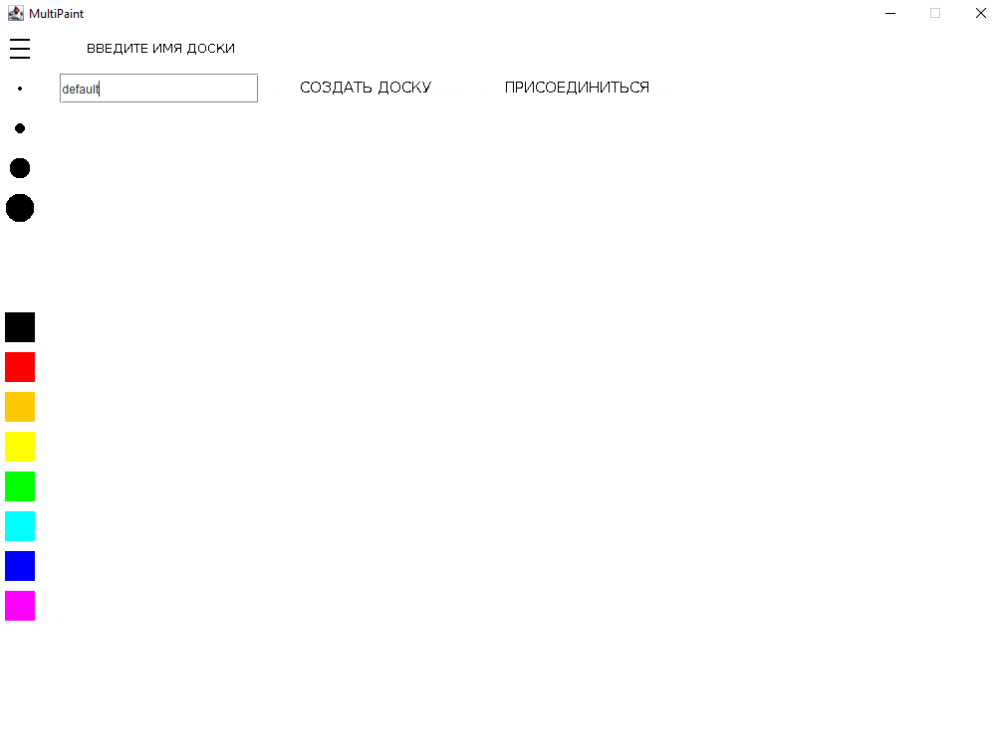
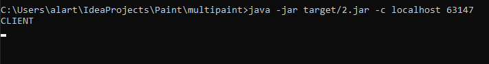
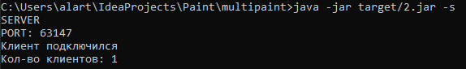

MULTIPAINT
Program start
compiling jar files via mvn package                                                           
start Server java -jar target/[name JAR-file] -s                                              
start Client java -jar target/[name JAR-file] -c localhost port(which the server will give us)
Paint window appears
Now we can draw

Многопользовательский пэинт
Начало работы
компиляция jar файлов через mvn package                                                           
запуск Сервера java -jar target/[name JAR-file] -s                                              
запуск Клиента java -jar target/[name JAR-file] -c localhost port(which the server will give us)
Paint window appears
Теперь мы можем рисовать
